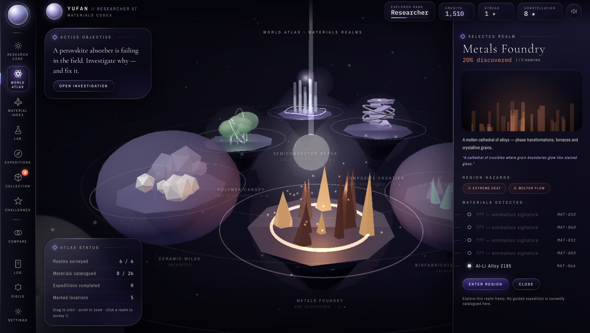
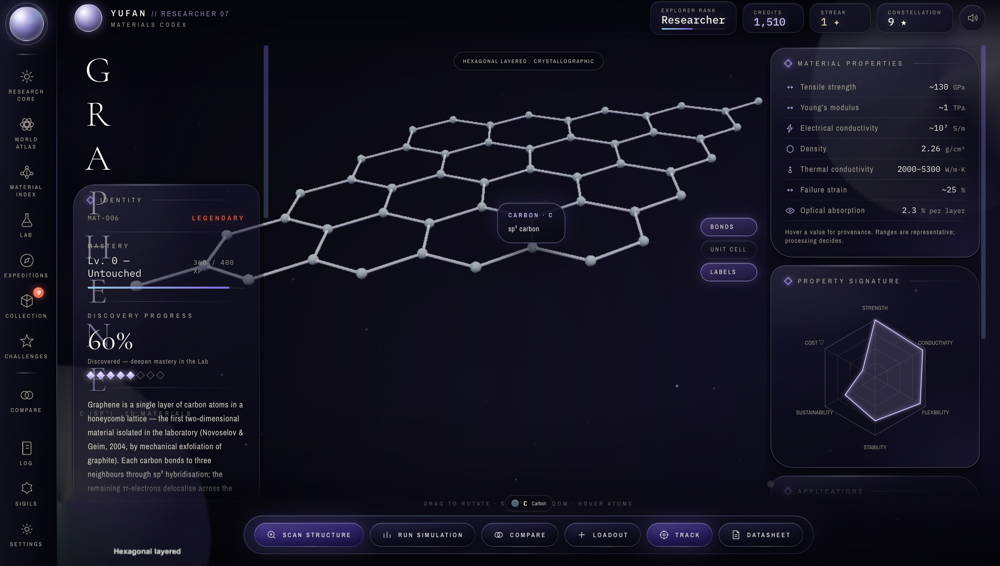

# MATERIDEX

*MATERIDEX is an interactive materials science universe for discovering, examining, testing, comparing and collecting materials through a visual browser experience.*

**Live demo:** [https://youufan.github.io/MATERIDEX/](https://youufan.github.io/MATERIDEX/)

## Overview

MATERIDEX combines a scientific material codex with a navigable universe. Its current database contains 26 materials distributed across six thematic regions, spanning carbon forms, metals, ceramics, semiconductors, polymers, composites and biofabricated systems. Each material connects descriptive data, properties, applications and related materials with an interactive structural representation.

The experience is designed for open exploration. Users can move freely between the Material Index, World Atlas, Codex, Laboratory, Compare, Collection, Challenges and Expeditions. Optional expeditions provide direction and rewards without restricting access to the core tools.

## Explore MATERIDEX



*The World Atlas presents material families as an explorable constellation of distinct realms.*



*The Material Codex combines an interactive scientific structure with properties, provenance and progression.*

## Main features

1. **Material Codex** presents identity, bonding, structure, synthesis, properties, applications, related materials and source information for every included material.

2. **Scientific structure viewer** renders crystallographic structures and clearly declared representative models with element colours, legends, unit cells, provenance and modelling notes. Structure data is checked by the included validation script.

3. **Material Index** provides constellation based exploration, text search, filters, saved searches, recent materials and property based comparison views.

4. **World Atlas** organises the material database into six interactive regions with distinct environments, hazards and material families.

5. **Laboratory** supports interactive tensile experiments with material selection, temperature, defect density, layer count, grain size and strain rate controls. Results can be saved for later review.

6. **Compare and Loadout** combines radar and tabular property comparisons with an airframe material assignment exercise, compatibility checks and predicted outcomes.

7. **Challenges** contains ten scored design scenarios covering tradeoffs in sensing, marine structures, energy storage, thermal protection, actuation, packaging and related applications.

8. **Expeditions** provide optional guided investigations. The current Perovskite Stability Problem explores moisture, heat and light degradation in methylammonium lead iodide and cites its scientific sources inside the experience.

9. **Collection and progression** records discoveries, duplicate specimens, family sets, mastery, achievements, research history and saved configurations. Progress is stored locally in the browser and can be exported or imported.

10. **Cinematic presentation** uses interactive three dimensional scenes, Canvas graphics, synthesised sound, responsive controls and reduced motion settings.

## Material exploration flow

1. Enter a region through the World Atlas or search the Material Index.

2. Open a material entry and inspect its scientific summary, structure, properties, applications and related materials.

3. Discover the material to add it to the Collection and advance its mastery record.

4. Test suitable materials in the Laboratory, compare property signatures or assign them to a loadout.

5. Apply the resulting understanding in Challenges or follow an optional Expedition.

6. Continue exploring freely while relevant expedition objectives are recognised in the background.

## Technology

MATERIDEX is a static browser application built with semantic HTML, custom CSS and plain JavaScript. Three.js provides WebGL rendering for structures, specimens, the atlas and cinematic scenes. Canvas provides constellation graphics, charts and scientific schematics. The Web Audio API generates interface sound, while browser local storage preserves progress and settings.

The repository vendors the Three.js runtime and post processing modules required by the application. Node.js is used only for repository validation and the production integrity check. No package installation or build bundler is required to run the site.

## Running locally

Clone the repository and enter its directory.

```text
git clone https://github.com/Youufan/MATERIDEX.git
cd MATERIDEX
```

Open `index.html` in a modern browser. The application runs directly from the repository files.

To validate the scientific structure records and confirm that all scripts and referenced assets are present, run:

```text
npm run build
```

## Repository structure

```text
MATERIDEX/
├── index.html                 Application shell and screen markup
├── css/                       Visual system and screen specific styles
├── js/
│   ├── data.js               Material, region, challenge and achievement data
│   ├── structure-data.js     Shared scientific structure records
│   ├── structures.js         Structure rendering and validation logic
│   ├── codex.js              Material entry and structure interactions
│   ├── constellation.js      Material Index exploration
│   ├── atlas.js              World Atlas rendering and interaction
│   ├── lab.js                Laboratory simulation
│   ├── loadout.js            Comparison and material loadout tools
│   ├── challenges.js         Engineering challenge scenarios
│   ├── expedition.js         Guided perovskite investigation
│   ├── collection.js         Collection and specimen views
│   ├── quests.js             Optional expedition and passive progression logic
│   ├── onboard.js            Cinematic introduction
│   └── core.js               Shared state, navigation and utilities
├── vendor/                    Vendored Three.js and post processing modules
├── scripts/                   Structure validation and production checks
├── STRUCTURE_AUDIT.md         Material structure audit and limitations
└── package.json               Validation commands
```

## Project status

MATERIDEX is an active browser based project with its complete interactive experience available from the main branch and GitHub Pages. The current production check validates all 26 material structure records, parses the application scripts and confirms that referenced local assets are present. Known scientific representation limits and modelling assumptions are documented in `STRUCTURE_AUDIT.md` and within individual material entries.

## Educational scope

Material values, structural models and simulations are intended for interactive education and exploration. They are simplified where necessary and should not be used as the basis for professional engineering, safety, manufacturing or material selection decisions.
